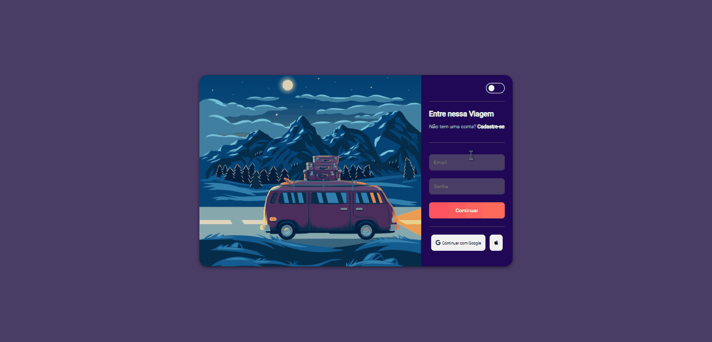

<h1 align="center">
   🌞 Dark themed Form page 🌚
</h1>

<h4 align="center">
  😉 This project was the first where I ventured to make a Dark theme
</h4>

## Photo 🎴
   

   
  
   

   
   <a href="#On">On</a> .
   <a href="#Roadmap">Roadmap</a> .
   <a href="#Technologies">Technologies</a> .
   <a href="#Photos">Photos</a> . 
   <a href="#Author">Author</a> 
   
 

   
 ## On ✔
     
     
   
 I created this project, to improve my skills with the technologies I use, and to challenge myself a little more to improve the Dark theme

   
   
   
 ## Roadmap 🗺
   
   
Innovative design and with a lot of didactics, this project helped me a lot to challenge and want to improve every day more, and with Responsiveness for all types of screens !!

   
   ## Technologies 🚀
   
   <h3 align="center"> Technologies used in the project 🙃 </h3>
   
   

- [Html](https://developer.mozilla.org/pt-BR/docs/Web/HTML/Element/html/)  
- [CSS](https://developer.mozilla.org/pt-BR/docs/Web/CSS)  
- [JavaScript](https://www.javascript.com/)  

 
 
   
    
## Author 🙋🏾‍♂️
   
 Hello, my name is João.   Follow me on <a href="https://www.linkedin.com/in/joaosoaressilva/" target="_blank">Linkedin</a> to see more about the projects I post.!

